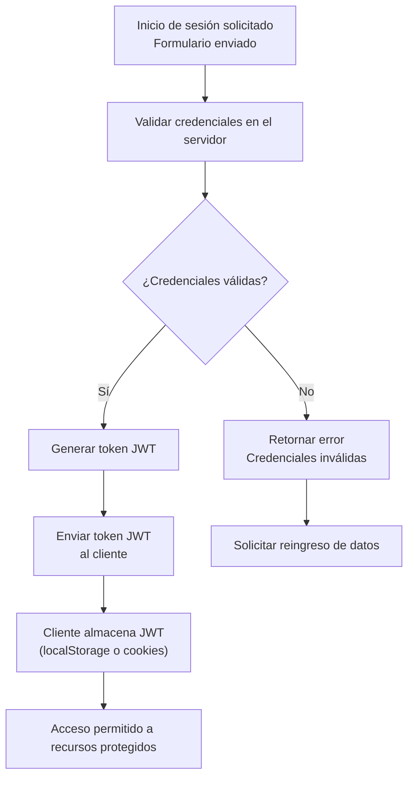

# Flujo de Autenticación

```mermaid
flowchart TD
    A["Inicio de sesión solicitado\nFormulario enviado"] --> B["Validar credenciales en el servidor"]
    B --> C{"¿Credenciales válidas?"}
    C -->|Sí| D["Generar token JWT"]
    C -->|No| E["Retornar error\nCredenciales inválidas"]
    D --> F["Enviar token JWT\nal cliente"]
    F --> G["Cliente almacena JWT\n(localStorage o cookies)"]
    G --> H["Acceso permitido a recursos protegidos"]
    E --> I["Solicitar reingreso de datos"]
```